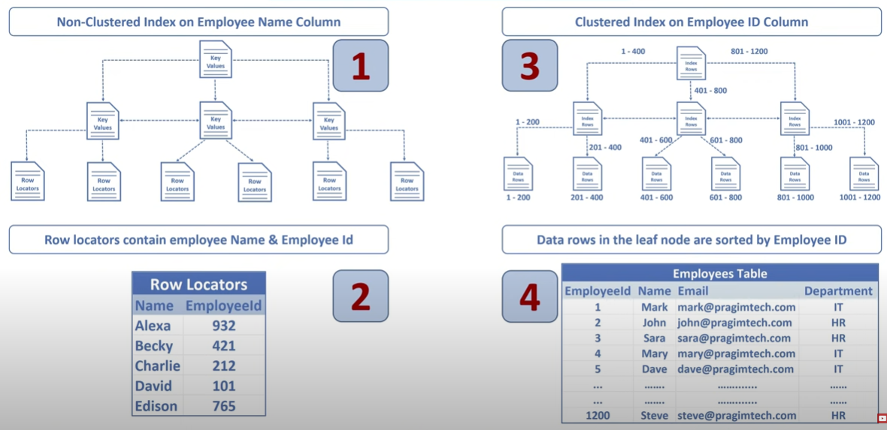
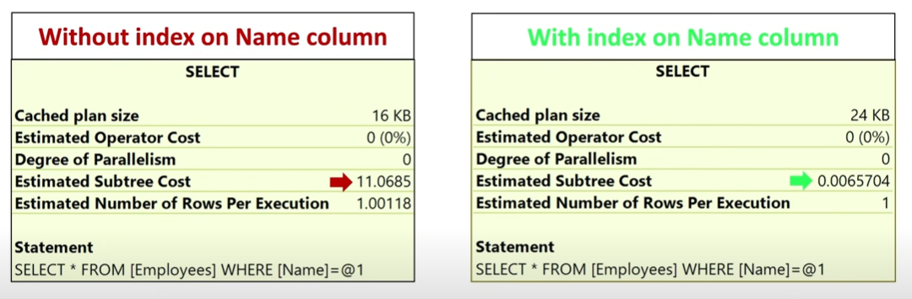

# SQL Indexes

# Clustered Index
A clustered index is an index in a database that determines the physical order of data rows in a table. It organizes the table's data on disk according to the indexed column, improving the performance of range-based queries and data retrieval. Each table can have only one clustered index, often based on the primary key.
However the index can contain multiple columns(a composite index).
--Possible one clustered index have more than one column.

# NonClustered Index
A non-clustered index is an index in a database that provides a separate structure to quickly look up data based on indexed columns. Unlike clustered indexes, it doesn't determine the physical order of data on disk. Multiple non-clustered indexes can be created on a table, enhancing query performance for specific columns.

A nonclustered index is analogous to an index in a textbook. The data is stored in one place, the index in another place. The index will have pointers to the storage location of the data.

Since, the nonclustered index is stored separately from the actual data, a table can have more than one on clustered index, just like how a book can have an index Chapters at the beginning and another index by common terms at the end.

In the index itself, the data is stored in an ascending or descending order of the index key, which doesn't in any way influence the storage of data in the table.

# Difference
1. Only one clustered index per table, where as you can have more than one non clustered index.
2. Clustered index is faster than a non clustered index, because, the clustered index has to refer back to the table, if the selected column not present in the table.
3. Clustered index determines the storage order of rows in the table, and hence doesn't require additional disk space, but where as a Non Clustered index is stored separately from the table, additional storage space is required.

# Unique Index
Unique index is used to enforce uniqueness of key values in the index.
Note: By default, PRIMARY KEY constraint, creates a unique clustered index.

UNIQUENESS is a property of an index, and both CLUSTERED and NONCLUSTERED indexes can be UNIQUE.
Difference between Unique Constraint and Unique Index?
There are no major differences between a unique constraint and a unique index. In fact, when you add a unique constraint, a unique index gets created behind the scenes.

